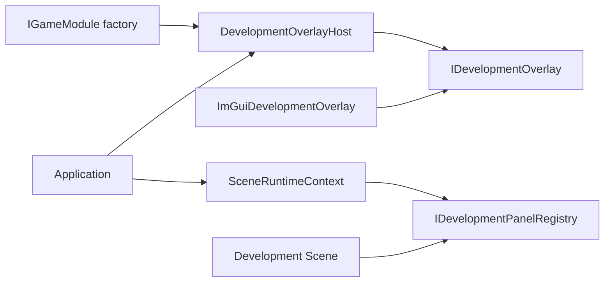

# Development Overlay 与 Dear ImGui

`DevelopmentOverlay` 是引擎提供给开发工具的可选覆盖层插槽。正式 UI、Scene、Physics 和 Gameplay 只依赖通用面板注册接口；`Application` 只编排通用生命周期，不包含 `imgui.h`，也不直接调用任何 Dear ImGui API。

## 构建开关与发布成本

当前仓库开发构建默认开启。发布构建如需完全移除开发工具，应显式关闭：

```powershell
cmake -S . -B build -DELYSIA_ENABLE_IMGUI=OFF
```

关闭时不会创建 `imgui_lib`，不会编译 ImGui adapter 或 game 侧 Physics Inspector，也不会链接 ImGui 符号。`Application` 中事件、逐帧和渲染接入点同样由编译条件移除；`SceneRuntimeContext::development_panels()` 始终返回空。因此显式关闭的发布构建没有 ImGui Context、字体 Atlas、事件处理、统计采集或绘制成本。

也可以显式开启或修正已有 CMake 缓存：

```powershell
cmake -S . -B build-imgui -DELYSIA_ENABLE_IMGUI=ON
cmake --build build-imgui --config Debug
```

开启后使用仓库固定的 Dear ImGui 1.92.9、`imgui_impl_sdl2` 与 `imgui_impl_sdlrenderer2`。不编译 `imgui_demo.cpp`，不启用 docking、multi-viewport 或 gamepad navigation。Overlay 隐藏时仍保留已初始化的 Context 和默认字体内存，但不向 backend 发送事件，不调用 `NewFrame`、面板 callback 或渲染。

修改 `option()` 的默认值不会覆盖已经存在的 `CMakeCache.txt`；旧构建目录需要重新配置并显式传入 `-DELYSIA_ENABLE_IMGUI=ON`。

## 分层与所有权



- `IGameModule::create_development_overlay()` 默认返回空；项目只有在启用构建中才创建具体 adapter。
- `DevelopmentOverlayHost` 独占 adapter，保留 F2，控制可见性，并保证隐藏时零逐帧调用。
- `SceneRuntimeContext` 只暴露可空 `IDevelopmentPanelRegistry`，Scene 不知道 Host 或 adapter 的具体类型。
- `ImGuiDevelopmentOverlay` 独占 ImGui Context、默认字体 Atlas 和两个官方 backend。
- shutdown 顺序为 SceneManager、Overlay、资源、Renderer、Window、SDL，保证 Scene 能先注销捕获自身的 callback。

## 帧与输入语义

1. 每个 SDL Event 先交给 Overlay Host；F2 的 key down/up 被 Host 消费，不进入游戏 RawInput。
2. Overlay 可见时，普通事件交给 ImGui backend，同时继续走 InputSystem 的窗口和设备生命周期处理。
3. InputSystem 使用上一完整 ImGui frame 的 `WantCaptureKeyboard`、`WantTextInput` 和 `WantCaptureMouse` 抑制键盘、文字或指针 RawInput。
4. 开始捕获时清理对应 held state 和鼠标增量，避免 Scene 收到卡住的按键；结束指针捕获时刷新逻辑鼠标位置。
5. Overlay 不请求 Gamepad capture，也不启用 ImGui gamepad navigation；手柄事件始终继续交给游戏。
6. update 前调用 `begin_frame()`；Scene、DebugDraw 和正式 UI 绘制后调用 Overlay `render()`；最后才 `SDL_RenderPresent()`。

Adapter 绘制前保存 SDL Renderer 的 render target、logical size、integer scale、scale、viewport、clip、draw color 和 blend mode，绘制后按正确依赖顺序恢复，避免污染正式渲染。

## 注册开发面板

Scene 只需在进入时注册，在退出、reset 和析构兜底路径中注销：

```cpp
auto* panels = runtime_context().development_panels();
if (panels)
{
    _panel = panels->register_panel(
        "project.example.inspector",
        [this]() { draw_inspector(); });
}

if (panels && _panel.is_valid())
    (void)panels->unregister_panel(_panel);
```

面板 stable ID 在一个 Overlay 生命周期内的活动集合中唯一；空 ID、空 callback 和重复 ID 会返回无效 handle 并记录诊断，不抛异常。handle 单调分配且不复用。绘制期间注册或注销会排队，当前批次使用进入绘制时的快照，修改从下一帧生效。

Panel callback 属于调用方代码，契约要求不得抛异常。若 callback 抛出，异常会传播到 Application render boundary，记录 `UnhandledException` 并进入 FaultExit；引擎不尝试回滚任意 ImGui 或 Scene 状态。

## Physics Combat Demo 示例

三个 Physics Combat Demo 由 `PhysicsCombatDemoSceneBase` 共同注册 `physics_demo.inspector`。F2 显示或隐藏 Overlay，F1 原有 DebugDraw 开关保持不变。Inspector 展示：

- frame delta、ImGui FPS 和场景名；
- fixed step、gravity、追赶步数和 solver iterations；
- object、collider、proxy、broad-phase、narrow test、contact、Tile、CCD、solver 和 dropped-step 统计；
- 当前按需物理调试快照的 shape、pair、Tile candidate、contact 和 velocity 数量；
- DebugDraw 全局开关及 Collider、Contact、ContactNormal、BroadPhase、CCD、Velocity、Gameplay 分类。

复选框直接修改现有 `DebugDraw`，Scene 下一次 update 再映射为 `PhysicsDebugCapture`。Inspector 不建立第二套物理调试状态，也不改变模拟结果。

## 当前限制

- Overlay 只用于开发工具，不替代正式 UI。
- 不提供布局持久化、自定义字体、远程调试、ImPlot、编辑器、多窗口或 Viewport。
- 面板 callback 必须在 Scene 注销前保持捕获对象存活。
- ImGui adapter 与 game 侧 Inspector 是生产代码中仅有的 `imgui.h` 使用点；其他模块应继续依赖通用契约。
