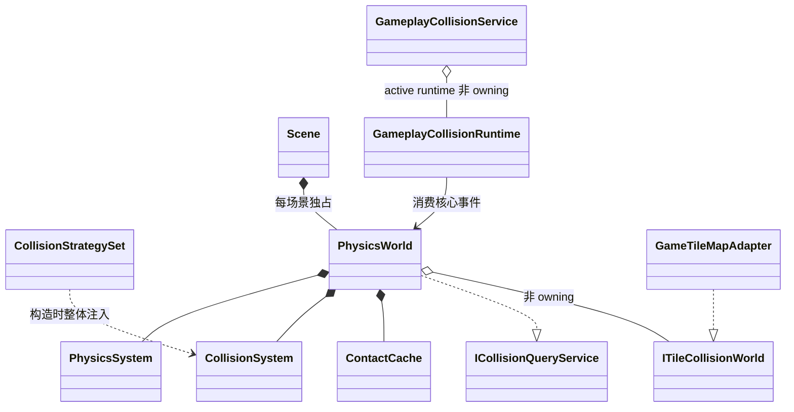
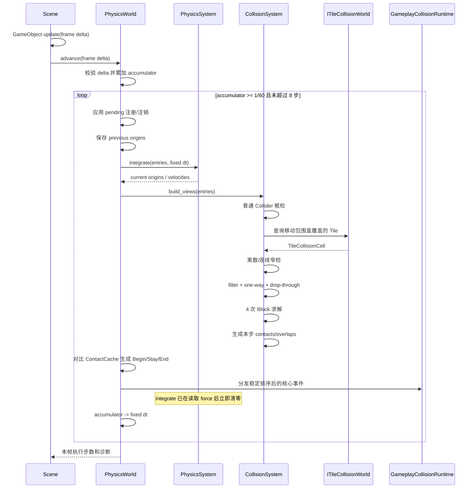
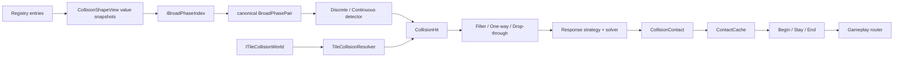

# 02｜目标架构与一帧数据流

> **实现状态**：本章描述的数据流已经落地。策略装配最终采用不可部分构造的 `CollisionStrategySet`，默认 SAP；早期草案中的全局 `PhysicsService` 已删除。当前实现索引见 [09](09-v1-implementation-reference.md)。

返回：[物理文档入口](README.md)　下一篇：[逐类职责](03-class-responsibilities.md)

## 1. 核心决策

每个 `Scene` 拥有一个 `PhysicsWorld`。世界拥有本场景的注册表、固定步状态、两个系统组件、接触缓存和当前 Tile World 借用指针，并实现查询服务。默认策略由 World 构造时创建，自定义策略必须作为完整 `CollisionStrategySet` 注入。



依赖方向必须保持：

```text
game -> engine/gameplay/collision -> engine/physics -> engine/core
```

`engine/physics` 不得 include `engine/gameplay/collision`。Gameplay runtime 可以消费 PhysicsWorld 输出的核心事件，但 PhysicsWorld 不认识 Actor 或 Attack。

## 2. 所有权与生命周期

| 对象 | Owner | 生命周期 | 关键规则 |
| --- | --- | --- | --- |
| `PhysicsWorld` | `Scene` | 与 Scene 实例一致 | Scene 退出前先停止事件，再清注册表 |
| `PhysicsSystem` | `PhysicsWorld` | 与 world 一致 | 无全局状态 |
| `CollisionSystem` | `PhysicsWorld` | 与 world 一致 | 独占策略实例 |
| `ContactCache` | `PhysicsWorld` | 与 world 一致 | 每固定步交换 current/previous |
| Body/Collider | `GameObject`/Provider | 不由 world 删除 | world 仅保存受控借用引用与句柄 |
| `ITileCollisionWorld` | Scene 或 gameplay map owner | 必须覆盖绑定期 | world 只保存一个非 owning 指针 |
| `GameplayCollisionRuntime` | Gameplay Scene/runtime | 场景活动期 | attach 到 Service，监听 PhysicsWorld |
| Strategy set | `PhysicsWorld` 构造者 | 与 CollisionSystem 一致 | 四个策略不可部分缺失 |

借用对象在物理步执行期间不得被立即销毁。对象的新增、禁用、销毁和注销请求先进入 pending queue，在固定步边界统一应用。

## 3. 一个渲染帧如何推进



事件按固定物理步分发，不合并成渲染帧事件。这样 Begin 和 End 即使发生在同一渲染帧的不同子步中也不会丢失。

## 4. 固定步长状态机

`PhysicsWorldConfig` 默认：

```cpp
struct PhysicsWorldConfig
{
    double fixed_delta_seconds = 1.0 / 60.0;
    std::uint32_t max_steps_per_advance = 8;
    std::uint32_t solver_iterations = 4;
    elysia::core::Vector2 gravity{};
};
```

`advance` 的规则：

1. delta 非有限或小于等于零：不修改 accumulator，不执行物理步；
2. 累加 delta；
3. while accumulator 足够且步数未达上限，执行 `fixed_step`；
4. 达上限后仍有一个以上完整步：丢弃完整步对应的超额时间，只保留不足一步的余数；
5. 增加 dropped-step 诊断计数，日志必须限频；
6. 返回实际执行步数，便于测试与性能统计。

首版不做渲染插值。未来若加入插值，应使用 previous/current Transform 生成只读 render transform，不能改写物理事实状态。

## 5. 注册与安全边界

### 注册

Scene 发现 Provider 后调用 `PhysicsWorld::register_object`。注册必须原子完成：

- 验证 owner、Body、Collider span；
- 拒绝同一 owner 重复注册，或幂等返回已有 handle；两种行为只能选一种，首版采用幂等返回已有 handle；
- 为 `InvalidColliderId` 分配新 ID；
- 非零 ID 若已经属于其他 Collider，则整次注册失败；
- 建立 owner → entry、ColliderId → collider slot 两个索引；
- 不接管 owner、Provider、Body 或 Collider 的所有权。

### 注销

物理步或事件回调期间调用注销，只进入 pending queue。安全点执行时：

- 从注册表和反向索引移除；
- 清除涉及其 Collider 的 contact cache；
- 对仍可安全识别的另一方产生 End；
- 清理 Gameplay binding 应由 Gameplay runtime 响应对象生命周期完成；
- ID 在当前 PhysicsWorld 生命周期内不再复用。

### Scene 退出

推荐顺序：

1. 停止 `advance`；
2. Gameplay Service detach 当前 runtime；
3. Gameplay runtime 解除 listener 与所有 binding；
4. PhysicsWorld 清除 Tile World；
5. PhysicsWorld 清注册表、pending queue 和 contact cache；
6. 最后销毁 GameObject。

退出清理不向已经卸载的 gameplay listener 分发 End。

## 6. Transform 与 Body 的事实来源

首版继续使用 `GameObject::position()` 作为 owner origin，Collider 形状是相对该 origin 的局部形状。PhysicsWorld 在固定步开始时保存 previous origin，积分和求解通过 `GameObject::set_position` 写回 current origin。

约束：

- 普通 gameplay update 不应在物理步中途修改 position；
- Dynamic 对象应通过力、冲量或速度驱动，避免每帧直接 set_position；
- Kinematic 可以由目标速度驱动；若 gameplay 直接传送，必须使用显式 teleport API，同步 previous/current，避免伪造 CCD 路径；
- Static 移动同样视为 teleport，并使相关缓存失效；
- `GameObject::time_scale` 首版只影响普通 update/animation，不影响 PhysicsWorld。

## 7. 碰撞数据流



粗检只产生“值得进一步检查”的候选，不决定响应。窄检只产生几何命中，不决定 Ignore/Overlap/Block。响应策略选择语义，solver 才修改 Transform/velocity。事件在求解后的最终状态上构建。

## 8. 核心事件与 Gameplay 事件

Physics 层事件使用 `CollisionTarget`：

```cpp
enum class CollisionTargetKind : std::uint8_t { Invalid, Collider, Tile };

struct TileCoordinate { int x = 0; int y = 0; };

struct CollisionTarget
{
    CollisionTargetKind kind = CollisionTargetKind::Invalid;
    ColliderId collider = InvalidColliderId;
    TileCoordinate tile{};
};
```

当 kind 为 Collider 时只读取 collider；当 kind 为 Tile 时，collider 必须无效并读取 tile。因为首版一个 Scene 只允许一个活动 Tile World，Tile 坐标在该 PhysicsWorld 内足以确定身份。

Gameplay runtime 消费核心事件后：

- Body 对普通 Collider 或 Tile 的 Block → BodyContact；
- PushBox 与 PushBox 的 Overlap → PushBoxOverlap；
- HitBox 与 HurtBox 的 Overlap → HitOverlap；
- 其他组合按 binding、role、team 和项目规则忽略或路由。

## 9. 暂停、禁用与销毁

| 状态 | 首版行为 |
| --- | --- |
| Scene paused | 不调用 `advance`，accumulator 不增加 |
| `PhysicsBody::enabled=false` | 不积分；其 Collider 是否参与由 Collider.enabled 独立决定 |
| `Collider::enabled=false` | 不参与候选、查询和新接触；旧接触在安全点产生 End |
| inactive GameObject | 与当前 Scene 约定一致，物理阶段跳过；应在状态同步点结束旧接触 |
| destroyed GameObject | 本步不得解引用；进入 pending unregister |
| teleport | 同步 previous/current，清除相关接触，下一步重新建立 |

## 10. 确定性最低要求

- Collider ID 单调递增且不复用；
- 普通 pair 总按较小 ID 在前；
- Tile target 按 `y`、再按 `x` 排序；
- candidate、contact、event 在输出前稳定排序并去重；
- Circle 中心重合等退化情况使用由 pair 顺序决定的固定法线；
- 不依赖裸指针地址、`unordered_map` 迭代顺序或注册容器的偶然内存布局；
- 相同初始状态、相同固定输入序列应得到相同事件序列和近似相同 Transform。

下一篇：[逐类职责](03-class-responsibilities.md)
