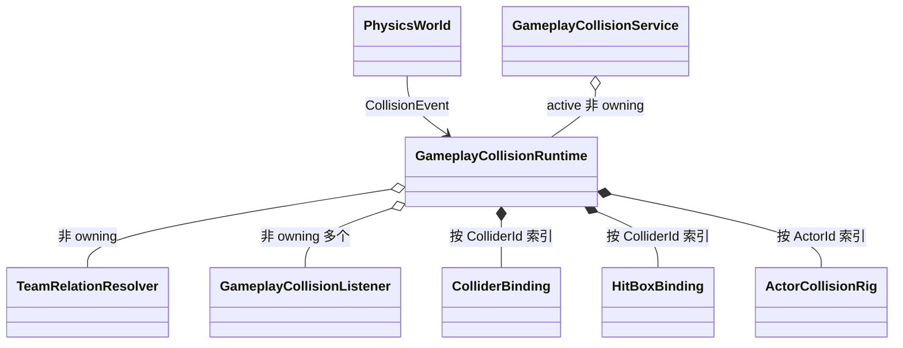

# 07｜Gameplay 碰撞 Runtime

> Gameplay 事件现已携带 `CollisionEventPhase`，Body/drop-through 已使用结构化 `CollisionTarget`，Runtime/Service 已具备 listener add/remove 契约；具体 `GameplayCollisionRuntime`、binding map、路由、命中去重和恢复逻辑仍未实现。

返回：[物理文档入口](README.md)　上一篇：[Tile Map 碰撞](06-tile-map-collision.md)　下一篇：[实施路线与测试](08-implementation-roadmap-and-tests.md)

## 1. 分层目标

PhysicsWorld 输出的事实是：两个 `CollisionTarget` 在一个固定步中 Begin/Stay/End，它们的 manifold 和最终 response 是什么。

Gameplay 层把事实解释成：

- 哪个 Collider 属于哪个 Actor；
- 它是 Body、PushBox、HurtBox、HitBox 还是 Sensor；
- 两个 Team 是 Friendly、Neutral 还是 Hostile；
- 攻击责任人和攻击定义是什么；
- 同一次攻击是否已经命中过目标；
- Body 是否请求临时穿过当前平台。

伤害数值、硬直、击退、音效和特效仍由具体 game 系统处理。Gameplay collision listener 只提供语义事件。

## 2. 目标对象关系



runtime 每 Scene 一个。全局 Service 只负责把业务调用转发给当前 Scene runtime。

## 3. Runtime 状态

建议持有：

```cpp
std::map<ActorId, ActorCollisionRig> _actor_rigs;
std::map<ColliderId, ColliderBinding> _collider_bindings;
std::map<ColliderId, HitBoxBinding> _hit_box_bindings;
std::map<AttackInstanceId, HitSet> _hit_history;
std::set<DropThroughKey> _drop_through_pairs;
std::vector<GameplayCollisionListener*> _listeners;
std::vector<PendingListenerOperation> _pending_listener_operations;
```

可以使用 unordered 容器做索引，但事件输出前必须排序，不能让 hash 迭代顺序影响 Gameplay。文档示意使用 map 是为了突出确定性，不强制性能实现。

runtime 还借用：

- 当前 PhysicsWorld 或其只读注册查询接口；
- `TeamRelationResolver`；
- PhysicsWorld 核心事件订阅句柄。

## 4. Binding 不变量

### `ColliderBinding`

- collider 是已在当前 PhysicsWorld 注册的有效 ColliderId；
- owner 是有效 ActorId；
- team 是有效 TeamId；
- 一个 ColliderId 只有一个 binding；
- role 与所在 rig 槽一致。

### `HitBoxBinding`

- 内嵌 collider binding 的 role 必须是 HitBox；
- instigator、attack_instance、attack_definition 都有效；
- owner 可以是投射物 Actor，instigator 可以是发射者；
- 同一 active attack instance 可以拥有多个 HitBox Collider。

### `ActorCollisionRig`

- owner 与 map key 相同；
- rig 内所有 ColliderId 不重复；
- body/push_box 可以 invalid，表示没有对应能力；
- hurt_boxes/sensors 允许为空；
- 所有非零 ID 必须存在相符 binding；
- `bind_actor` 原子提交，失败不留下部分索引。

## 5. 建议事件形状

当前事件缺少 phase，Body 的 other 也不能表达 Tile。目标调整：

```cpp
struct BodyContactEvent
{
    CollisionEventPhase phase = CollisionEventPhase::Begin;
    ColliderBinding body{};
    CollisionTarget other{};
    CollisionContact contact{};
};

struct PushBoxOverlapEvent
{
    CollisionEventPhase phase = CollisionEventPhase::Begin;
    ColliderBinding first{};
    ColliderBinding second{};
    CollisionOverlap overlap{};
};

struct HitOverlapEvent
{
    CollisionEventPhase phase = CollisionEventPhase::Begin;
    HitBoxBinding hit_box{};
    ColliderBinding hurt_box{};
    CollisionOverlap overlap{};
};
```

`CollisionContact`/`CollisionOverlap` 自身也应升级为结构化 target pair。Gameplay event 中复制 binding 快照，避免 listener 回调中解绑后借用失效。

## 6. Role 路由表

| A role/target | B role/target | Physics response | Gameplay 输出 |
| --- | --- | --- | --- |
| Body | Tile | Block | BodyContact |
| Body | 普通 World/Body | Block | BodyContact；项目可决定是否双方各一条 |
| Body | Sensor/Overlap | Overlap | 首版可作为 BodyContact 或新增 Sensor 事件，必须统一 |
| PushBox | PushBox | Overlap | PushBoxOverlap |
| HitBox | HurtBox | Overlap | HitOverlap（定向） |
| HurtBox | HitBox | Overlap | 交换为 HitBox→HurtBox 后输出 |
| HitBox | HitBox | 任意 | 默认忽略 Gameplay |
| HurtBox | HurtBox | 任意 | 默认忽略 Gameplay |
| Sensor | 任意 | Overlap | 首版暂不声明专用事件，可由 BodyContact 扩展或后续加入 |

为了避免模糊，首版建议只把表中明确的前三类事件作为承诺；Sensor 专用路由列入后续。物理 Overlap 仍正常存在。

## 7. Pair 规范化

Physics pair 顺序按 target 身份，与 Gameplay 角色方向无关。runtime 必须重新规范：

- BodyContact：被绑定为 Body 的一方放入 `body`；contact manifold 若交换双方，normal 取反；
- PushBoxOverlap：按 ActorId、再 ColliderId 稳定排序 first/second；这是对称事件；
- HitOverlap：HitBox 永远是 hit_box，HurtBox 永远是 hurt_box；交换时 manifold normal 取反，使其仍从 hit 指向 hurt。

禁止假定 `pair.first` 就是攻击方。

## 8. TeamRelation

物理 filter 决定是否有几何候选；TeamRelation 决定是否形成 Gameplay Hit。

推荐默认资格：

| relation(instigator team, hurt team) | HitOverlap |
| --- | --- |
| Hostile | 允许 |
| Friendly | 默认拒绝 |
| Neutral | 由攻击定义/项目规则决定，runtime 默认拒绝 |

因为 `HitBoxBinding` 只保存 instigator ActorId，没有直接保存 instigator Team，runtime 应通过 Actor rig/binding 查找。找不到时记录诊断并拒绝命中，不能把无效来源当 Hostile。

TeamRelationResolver 只返回关系，不读取攻击定义；“攻击能否伤害 Neutral”属于上层 listener/攻击规则。若需要该能力，runtime 可先输出关系信息而不是在物理层硬编码。

## 9. Begin / Stay / End

### Body

- Begin：建立接地/墙/天花板候选，通知 listener；
- Stay：刷新持续支撑和移动平台关系，通知 listener；
- End：移除对应支撑，通知 listener。

一个 Body 可以同时接触多个 Tile。grounded 状态应由当前所有有效向下 Block contacts 派生，不能在任一 End 时直接置 false。

### PushBox

Begin/Stay/End 都路由。PushBox 本身在物理层通常配置 Overlap；角色推挤若需要位移，Gameplay 系统消费 overlap 后产生明确移动意图，不能把 HurtBox 当 PushBox 使用。

### HitBox

- Begin：检查 team 与 hit history；首次合法命中才发 `HitOverlapEvent`；
- Stay：默认不重复发伤害命中；可以不通知 listener；
- End：不撤销已经发生的命中，可以用于调试或后续状态扩展。

如果设计需要持续伤害，必须由攻击定义提供 tick 规则，不能让所有 Stay 自动伤害。

## 10. 攻击命中去重

建议 key：

```text
AttackInstanceId -> set<ActorId hurt_owner>
```

这样同一挥砍的多个 HitBox 或 HurtBox 不会对同一 Actor 重复命中。若项目需要“每个 hurt box 可单独命中”，再把 key 扩展到 ColliderId；首版采用 Actor 粒度。

流程：

1. 验证 HitBox/HurtBox binding；
2. 解析 hurt owner；
3. 检查 TeamRelation；
4. 查询 `_hit_history[attack_instance]`；
5. 已包含 hurt owner：忽略；
6. 未包含：先插入，再通知 listener，防止回调重入导致重复；
7. `end_attack_instance` 显式清理。

监听器抛异常的策略应与引擎统一。若允许异常传播，history 已写入，因此重试不会重复；若引擎禁止回调异常，应捕获、记录并继续下一个 listener。首版建议引擎回调边界捕获并记录，保持物理步完整。

## 11. Drop-through

### 请求验证

runtime 接收请求后检查：

- actor 是已绑定的 Body Collider；
- target 是当前 PhysicsWorld 有效 Collider 或 Tile；
- target 配置 OneWay；
- actor 当前对 target 有向下支撑 Block contact；
- actor 与 target 不是同一普通 Collider；
- 尚未存在相同 ignore key。

### Tile 平台

角色可能同时站在多个相邻 OneWay Tile 上。请求时读取当前支撑 contacts，把法线满足 grounded threshold 的相邻 OneWay targets 一次性加入 ignore set。

### 恢复

每固定步后检查：

- actor/target 注销：立即删除；
- Tile World 清除：删除所有 Tile key；
- actor 仍与目标 rect 相交或未越过 tolerance：保留；
- 完全离开：删除。

宽限时间只能作为避免数值抖动的附加保护，不能取代几何恢复条件。

## 12. Listener 生命周期

listener 集合是非 owning。规则：

- add 同一地址幂等；
- remove 未注册地址返回 false；
- 分发按注册顺序；
- 分发期间 add/remove 记录为 pending，当前事件使用开始分发时的快照；
- listener 回调可以请求对象 destroy/unbind，实际物理注册修改在安全点应用；
- runtime detach/析构前清 listener 集合；
- listener 析构前主动 remove。

若 listener A 在回调中移除 listener B，B 是否收到当前事件容易产生歧义。首版采用快照语义：B 仍收到当前事件，从下一事件开始移除。

## 13. Service 与 Scene 生命周期

### Scene 进入

```text
构造 PhysicsWorld
PhysicsService.apply_to(world.collision_system)
构造 GameplayCollisionRuntime(world, relation_resolver)
runtime 订阅 PhysicsWorld
GameplayCollisionService.attach_runtime(runtime)
注册对象和 binding
绑定 Tile World
```

任一步失败时按相反顺序回滚。attach 冲突必须让 Scene enter 失败或显式禁用 Gameplay 碰撞，不能继续在半连接状态运行。

### Scene 退出

```text
停止 Scene update/physics advance
GameplayCollisionService.detach_runtime(runtime)
runtime 取消 PhysicsWorld 订阅
runtime 清 listeners / bindings / hit history / drop-through
PhysicsWorld clear Tile World
PhysicsWorld reset
销毁 runtime、adapter、map、objects
```

### Service shutdown

`GameplayCollisionService` 当前没有 shutdown。只要每个 Scene 严格 detach 就足够；若 Application teardown 需要兜底，可新增身份明确的 `shutdown()`，但不能在旧 Scene 析构时清掉新 Scene runtime。

## 14. Binding 操作失败规则

| 操作 | 返回 false 的情况 | 必须保持 |
| --- | --- | --- |
| bind_actor | invalid owner/team、重复 rig 冲突、Collider 缺失/重复/role 不符 | 旧 maps 完全不变 |
| bind_collider | invalid 字段、Collider 未注册、ID 已绑定 | 旧 binding 不变 |
| bind_hit_box | role 非 HitBox、attack IDs 无效、普通 binding 冲突 | 不留下普通半 binding |
| unbind_collider | invalid/未知 ID | 其他 binding 不变 |
| request_drop_through | 非支撑、非 OneWay、目标失效 | ignore set 不变 |
| end_attack_instance | invalid/未知 ID | 其他 history 不变 |

开发期错误记录 `collision` 类别日志，正常的“已经解绑”若调用方允许幂等可降为 debug。首版保持当前 bool 契约，不通过异常报告业务拒绝。

## 15. Gameplay 测试矩阵

### Binding

- 单 Collider、完整 rig、无 Body rig；
- 一个 Collider 重复出现在 hurt_boxes；
- body ID 绑定为 HurtBox；
- HitBox role 错误；
- 重复 owner rig；
- 失败后所有 map 数量不变；
- unbind 同时清 rig、HitBox map、hit history 引用和 drop-through。

### 路由

- Physics pair 正序/反序产生相同语义事件；
- Body/Tile target 保留具体坐标；
- PushBox 以 ActorId/ColliderId 稳定排序；
- HitBox/HurtBox 始终定向；
- 无 binding、同 role 非法组合安全忽略并限频诊断。

### 阵营与命中

- Hostile 首次 Begin 命中；
- Friendly 拒绝；
- Neutral 默认拒绝；
- 一个 attack 的多个 HitBox 不重复伤同一 Actor；
- 新 attack instance 可以再次命中；
- Stay 不重复；
- `end_attack_instance` 清理后 ID 不应复用，若项目复用则视为新实例并显式建立。

### 生命周期

- 无 active runtime 时 Service 日志并返回 false；
- 同一 runtime attach 幂等；
- 不同 runtime 冲突；
- 错误实例 detach 不影响 active；
- listener 在回调中 add/remove/unbind；
- Scene exit 后 Service 无悬空 runtime；
- Tile World clear 清 drop-through 与支撑状态。

下一篇：[实施路线与测试验收](08-implementation-roadmap-and-tests.md)
