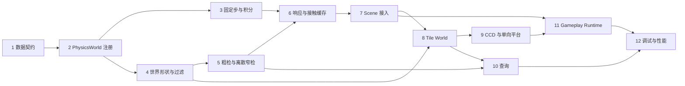

# 08｜实施路线与测试验收

> **进度更新（2026-08）**：阶段 1—12 的无旋转 2D 首版均已落地。默认宽相为 SAP，Brute Force 保留为正确性 oracle；四叉树仍是可选后续实现。各阶段的“修改/测试”条目现在同时作为回归验收清单。

返回：[物理文档入口](README.md)　上一篇：[Gameplay Runtime](07-gameplay-collision-runtime.md)

## 1. 实施原则

- 每阶段都必须能单独编译、运行测试和回滚；
- 先建立数据不变量和纯算法测试，再接入 Scene；
- 不在一个提交中同时重构注册、实现算法、接 Gameplay 和改角色逻辑；
- Brute Force 和离散算法作为正确性基线，性能结构后置；
- 已落地 API 可以被 Scene 生命周期代码依赖，但不得把空算法阶段描述为真实物理能力；
- 不用 Sandbox “看起来没穿墙”代替边界和退化单元测试。

推荐为每阶段建立独立测试 target 或在 `tests/physics/` 中按模块拆文件，统一使用 `LABEL physics`。

## 2. 阶段依赖图

## 阶段 1：整理数据契约与 BodyType（已完成）

### 目标

消除当前契约中会导致实现歧义的状态，尚不移动任何 GameObject。

### 修改

- 增加 `BodyType { Static, Kinematic, Dynamic }`；
- 用 type 替换 PhysicsBody 的 `is_static`/`is_kinematic`；
- 明确 mass、damping、max_speed、gravity_scale 的有效范围；
- 增加 `CollisionTarget`、`TileCoordinate`、`CollisionEventPhase`；
- 把 Contact/Overlap/QueryHit 调整为结构化 target；
- 为 `ColliderProvider` 增加 mutable span；
- 更新 EngineCharacter 等现有 Provider 编译适配；
- 保留 ColliderShape 仅 AABB/Circle。

### 测试

- 默认 Body 是 Dynamic 还是 Static 必须显式决定；建议默认 Dynamic 以保持当前运动数据直觉；
- 三个 BodyType 唯一；
- target 构造、有效性、相等、排序；
- Collider/Tile target 非法组合拒绝；
- Provider mutable/const span 一致；
- 现有 contract tests 更新后全部通过。

### 完成定义

公共数据模型不再需要实现者猜测 Tile 身份、Body 状态或 Collider ID 写入方式。此阶段不应出现 PhysicsWorld 或碰撞算法。

### 常见错误

- 保留旧 bool 并同时新增 enum，形成两套事实来源；
- 把 TileCoordinate 塞进 ColliderId 位段；
- 让 CollisionTarget 保存项目 map 指针；
- 默认 mass=0 导致 Dynamic 无法积分。

## 阶段 2：PhysicsWorld、注册表与稳定 ID（已完成）

### 前置

阶段 1。

### 修改

- 增加 `PhysicsWorldConfig`、`PhysicsObjectHandle`、`PhysicsWorld`；
- 定义明确的 registry entry，而不是继续依赖 Scene 私有匿名模板结构；
- 建立 owner、handle、ColliderId 三向索引；
- 实现原子注册、幂等重复注册和立即注销；步中重入当前拒绝，pending queue 留到事件阶段；
- ColliderId 与 handle 从 1 单调递增，世界生命周期内不复用；
- previous/current origin 首次都取注册时 position；
- 增加 reset 与失效对象清理；
- 尚不接 Scene，使用 fake owner/provider 单元测试。

### 测试

- Body-only、Collider-only、Body+多个 Collider；
- Collider span 为空；
- invalid ID 自动写入；
- 预设非零唯一 ID 接受；冲突拒绝；
- 同 owner 重复注册返回同 handle；
- 多 Collider 中途失败完整回滚；
- 注销后索引全消失，ID 不复用；
- pending 注销在安全点前仍可查询、之后不可查询；
- reset 不解引用已经释放对象。

### 完成定义

给定 owner/provider，world 能建立和销毁一致注册状态；还不移动、不碰撞。

## 阶段 3：固定步长与 Body 积分（已完成）

### 前置

阶段 2。

### 修改

- 实现 `advance` accumulator 与最多 8 步；
- 实现 stepping/reentrancy guard；
- 实现 previous origin snapshot；
- 实现 PhysicsSystem Dynamic/Kinematic/Static 积分；
- 世界 gravity 默认 zero，由项目配置；
- Dynamic 使用半隐式欧拉；
- 应用阻尼和每轴 max_speed；
- 步尾清全部 Body accumulated_force；
- 增加 teleport，同步 previous/current 并清相关缓存钩子；
- 增加 dropped-step 计数，日志限频。

### 测试

- `advance(1/120)` 两次只执行一步；
- `advance(1/60)` 一步；
- 大 delta 最多 8 步并只保留不足一步余数；
- 负数、0、NaN、Infinity 不推进；
- Dynamic 重力/力/质量计算；
- Kinematic 忽略力和重力；
- Static 不移动；
- 阻尼不反转速度；
- 每轴限速与“不限速”零值；
- disabled Body 不积分但 force 在步尾清除；
- individual GameObject time_scale 不影响结果；
- 相同输入序列重复运行得到相同结果。

### 完成定义

没有 Collider 时，world 已能稳定驱动 Body；Scene 尚未接入。

## 阶段 4：世界形状与过滤（已完成）

### 前置

阶段 1、2。

### 修改

- 实现 previous/current AABB/Circle 世界转换；
- 实现 Circle broad-phase AABB 与 swept bounds；
- 实现 shape 参数验证；
- 实现统一 `should_collide`；
- 明确 response 合并纯函数；
- 使用值语义 CollisionShapeView 保存 target、owner handle、世界形状和 origins；
- build_views 按 ColliderId 稳定排序。

### 测试

- 非零 owner origin 与非零 local offset；
- previous/current 分离；
- 空 AABB、零/负/NaN Circle；
- category/mask 必须双向匹配；
- 正 group 强制允许、负 group 强制忽略；
- group 不同回落 mask；
- Ignore/Overlap/Block 合并表；
- build_views 跳过 disabled/destroyed 并保持排序。

### 完成定义

任何注册 Collider 都能产生可信固定步 view，过滤规则只有一个事实来源。

## 阶段 5：Brute Force、SAP 与离散窄检（已完成）

### 前置

阶段 4。

### 修改

- 实现 `BruteForceBroadPhaseIndex`（遵守 `IBroadPhaseIndex`）；
- 实现 AABB/AABB；
- 实现 Circle/Circle；
- 实现 AABB/Circle，并支持输入交换；
- 实现 `DefaultDiscreteCollisionStrategy`；
- CollisionSystem collect/detect 输出 contact，但先不修正位置；
- 默认 CollisionStrategySet 由 PhysicsWorld 构造，测试可整体注入 Brute Force。

### 测试

- 分离、边界接触、轻微/深度穿透；
- AABB 最小穿透轴和平局；
- Circle 相切、重叠、中心重合；
- Circle 在 AABB 外、边角、内部；
- 交换 pair 后法线严格翻转；
- normal 单位长度、penetration 非负、contact count≤2；
- broad phase 不漏所有真实离散命中；
- pair 去重和稳定顺序；
- 空策略槽安全报错而非崩溃。

### 完成定义

系统能可靠报告普通 Collider 当前重叠，但还不会阻挡或生成生命周期事件。

## 阶段 6：Block/Overlap 响应与 ContactCache（已完成）

### 前置

阶段 3、5。

### 修改

- 实现 `DefaultCollisionResponseStrategy` 的 response 合并；
- 实现 inverse-mass 位置和法向速度修正；
- 默认 4 次稳定迭代；
- Overlap 保持非阻挡；
- 实现 CollisionFrame 和 ContactCache；
- 生成 Begin/Stay/End；
- 增加核心 listener 注册和延迟修改；
- disable、unregister、teleport 清理对应 cache。

### 测试

- Dynamic/Static、Dynamic/Kinematic、Dynamic/Dynamic 质量加权；
- 两个无限质量对象不除零；
- closing velocity 被移除，separating velocity 保留；
- 切向速度不变；
- Overlap 不改 Transform/velocity；
- Begin→Stay→End；
- 同一步重复 hit 去重；
- disable/unregister 产生 End；
- reset 静默清缓存；
- listener 回调中 add/remove/unregister；
- 事件稳定排序。

### 完成定义

纯普通 Collider 世界已经具备可用的离散 Block/Overlap 和事件生命周期。

## 阶段 7：Scene 生命周期接入（已完成）

### 前置

阶段 6。

### 修改

- `Scene` 改为拥有 `PhysicsWorld`；
- 对象加入时把 Provider 注册给 world；
- 销毁/移除时排队注销；
- 非暂停帧普通 update 后调用 `world.advance(delta)`；
- 删除或收缩 Scene 对 PhysicsSystem/CollisionSystem 的直接持有；
- Scene 创建的 PhysicsWorld 默认已经拥有完整策略；
- 暴露受保护/只读 physics world/query 入口供派生 Scene；
- EngineCharacter 等示例对象只选择一种运动方式，避免 update 直接移动与 PhysicsBody 重复移动。

### 测试

- Scene 自动注册 Body/Collider；
- Collider-only 与 Body-only 对象；
- paused Scene 不积 accumulator；
- inactive/destroyed 对象不参与；
- Scene reset/reuse 不遗留 handle/contact；
- 不完整 CollisionStrategySet 在构造时抛出，Scene 不会进入半配置状态；
- 对象在事件中 destroy，帧尾安全移除；
- 不发生悬空 provider 解引用。

### 完成定义

示例 Scene 能通过真实 PhysicsBody/Collider 运动和碰撞；Scene 保持只调用 `PhysicsWorld::advance`。

## 阶段 8：Tile Collision World（已完成）

### 前置

阶段 4、7。

### 修改

- 增加 Tile 类型与 `ITileCollisionWorld`；
- PhysicsWorld 实现单 adapter 身份校验式 bind/clear；
- 实现 world-to-tile、tile_rect、candidate_range；
- 实现 Empty/Block/Overlap 和越界策略；
- Tile contact 使用结构化 target；
- 项目/game 层增加 TileMap adapter；
- 先支持 AABB Body 的离散/分轴 Block，再统一进入 contact solver；
- 增加 Tile debug candidate 绘制接口。

### 测试

- origin 为零/非零；
- 负世界坐标 floor；
- 16×32 非正方形 Tile；
- right/bottom 半开边界；
- 0×0 地图；
- Empty/Block 越界；
- Block/Overlap；
- 多 Tile contact 稳定排序；
- 相邻墙接缝滑动；
- 同 adapter 重复 bind、不同 adapter 冲突、错误实例 clear；
- map 先 clear 后销毁无悬空访问。

### 完成定义

规则静态地图可阻挡 AABB Body 并产生 Tile 坐标明确的事件；尚不承诺高速和 OneWay。

## 阶段 9：Swept AABB 与单向平台（已完成）

### 前置

阶段 8。

### 修改

- 实现普通 AABB/AABB 与 AABB/Tile swept 检测；
- Continuous mode 选择正确策略；
- 处理初始穿透、零相对速度和 TOI 平局；
- 实现 four-direction one-way；
- 引入 response context 查询 drop-through key；
- Gameplay request 支持结构化 Tile target；
- runtime 从当前所有支撑 OneWay Tile 建立 ignore set；
- 完全离开后恢复。

### 测试

- 高速横向/纵向穿墙；
- 对角移动与滑墙；
- moving platform 相对运动；
- 初始重叠；
- TOI=0、TOI=1、轴速度为零；
- Circle Continuous 明确回退并诊断；
- Up/Down/Left/Right one-way 正反方向；
- tolerance 边界；
- drop-through 只影响目标支撑面；
- 多相邻 Tile 一次请求全部忽略；
- 离开后再次落下恢复 Block。

### 完成定义

AABB Continuous 不穿一格厚墙，单向平台与临时下落行为在移动平台和 Tile 上一致。

## 阶段 10：RayCast 与 SegmentCast（已完成）

### 前置

阶段 5、8。

### 修改

- PhysicsWorld 实现 `ICollisionQueryService`；
- AABB slab、Circle ray、Tile DDA；
- Segment 转有限 Ray；
- QueryHit 使用 CollisionTarget；
- 普通 Collider 与 Tile 统一最近命中比较；
- 查询严格只读，不产生事件。

### 测试

- Ray/AABB 每个面、平行轴、origin inside；
- Ray/Circle 两根、切线、inside；
- Tile DDA 水平/垂直/对角/格角平局；
- Segment 终点前后边界；
- zero direction/length、负 distance、NaN；
- filter/group；
- disabled/Ignore 目标；
- 普通 Collider 与 Tile 距离平局按 target 稳定排序；
- Block 越界起点 fraction=0。

### 完成定义

AI/Gameplay 能查询当前提交世界的最近普通 Collider 或 Tile，重复查询无状态变化。

## 阶段 11：GameplayCollisionRuntime（已完成）

### 前置

阶段 7、9。

### 修改

- 实现具体 runtime 和 Physics core listener；
- 实现 actor/collider/hitbox binding maps 与原子验证；
- 增加 listener 管理；
- 路由 Body、PushBox、HitBox/HurtBox；
- 事件增加 phase，Body other 使用 CollisionTarget；
- 实现 TeamRelation 查询；
- 实现 attack-instance→hurt-owner 去重；
- 实现 end_attack_instance；
- 接入 GameplayCollisionService 的 Scene attach/detach；
- 注销对象时清 binding、history 和 drop-through。

### 测试

- 复用现有 Service 测试并保持兼容；
- binding 成功/冲突/失败回滚；
- pair 交换后的 role 规范化；
- Body/Tile、PushBox/PushBox、HitBox/HurtBox；
- Hostile/Friendly/Neutral；
- 同 attack 多 HitBox、多 HurtBox 对同 Actor 只命中一次；
- Stay 不重复伤害；
- listener 快照修改；
- Scene exit 后无 active runtime；
- drop-through 生命周期。

### 完成定义

物理事件可以稳定转换为业务语义，但 runtime 本身不结算伤害。

## 阶段 12：调试、诊断与性能基线（已完成）

### 前置

阶段 10、11。

### 修改

- 增加 Collider previous/current、broad bounds、Tile candidates、contact normal、TOI、query debug draw；
- 增加无效配置、ID 冲突、dropped steps、unsupported Circle CCD 的限频日志；
- 增加 world 统计：注册 Body/Collider、候选数、窄检数、contact 数、solver iterations、Tile samples、query candidates；
- 建立 Brute Force 性能基线；
- 只有真实数据证明需要时再规划 Sweep-and-Prune/chunk cache。

### 测试与基准

- debug disabled 时不积累命令；
- enabled category 只输出对应几何；
- 日志限频不会每 fixed step 刷屏；
- 100/500/1000 Collider 的候选与耗时基线；
- 大 Tile Map 查询成本与访问格数相关，而不是总格数；
- 优化策略的 contact 结果与 Brute Force oracle 一致。

### 完成定义

开发者能解释某次碰撞为何被过滤、命中、忽略或求解，并有数据判断下一步优化方向。

## 3. 跨阶段验收场景

### 平台角色

Dynamic AABB 受向下重力，落到 Block Tile 后 grounded；沿墙移动不穿透；跳起命中天花板；从下方穿过 OneWay，再落到其上；drop-through 后完全离开并恢复。

### Top-down 角色

world gravity=zero；Kinematic/Dynamic 角色按显式速度移动；墙 Tile 阻挡；Overlap Tile 产生 Begin/Stay/End；GameObject time_scale 不改变物理速度。

### 动态对象

两个不同质量 Dynamic AABB 相撞，位置修正按逆质量分配；切向速度保留；Static/Kinematic 不被反推。

### 战斗

PushBox 重叠持续路由；Hostile HitBox 对 HurtBox 首次 Begin 命中；Stay 不重复；同 attack 的第二个 HitBox 不重复；新 attack instance 可再次命中。

### 查询

同一 Ray 前方依次有 Overlap Circle、Block AABB、Block Tile，filter 决定候选后返回最近 target；重复查询不改变事件或 contact。

## 4. 失败与回归检查表

- 是否仍存在两个互不协调的 Scene system 入口？
- Collider ID 是否可能因 vector 扩容或对象地址改变？
- 是否用裸指针地址排序事件？
- 是否对负世界坐标使用 int 截断？
- 是否把 Tile 展开成成千上万 Collider？
- 是否只检查单向平台对象自己的 velocity？
- 是否在 Overlap 中修改位置？
- 是否在 Hit Stay 每步重复伤害？
- 是否在 listener 回调中立即 erase 当前遍历容器？
- 是否让 query 推进模拟或生成事件？
- 是否允许 NaN 进入排序、TOI 或 position？
- 是否在 Scene exit 后留下 active Gameplay runtime 或 Tile adapter 指针？

任何一项为“是”都不应进入下一阶段。

## 5. 当前公开符号文档覆盖表

| 当前符号 | 类职责 | 函数职责/算法 |
| --- | --- | --- |
| `PhysicsBody` | [03 §2](03-class-responsibilities.md#physicsbody当前存在建议调整) | [04 §5](04-function-responsibilities.md#5-physicssystem-函数) |
| `PhysicsSystem::integrate` | [03 §2](03-class-responsibilities.md) | [04 §5](04-function-responsibilities.md#5-physicssystem-函数) |
| AABB/Circle/ColliderShape | [03 §3](03-class-responsibilities.md#3-collider-与形状) | [05 §2、6—8](05-collision-algorithms.md#2-世界形状构造) |
| Filter/Response/DetectionMode | [03 §3](03-class-responsibilities.md#collisionfilter当前存在) | [05 §4、11](05-collision-algorithms.md#4-collisionfilter) |
| PassThrough/OneWay | [03 §3](03-class-responsibilities.md#passthroughdirection--onewaycollision当前存在) | [04 §2](04-function-responsibilities.md#2-现有小型纯函数)、[05 §12](05-collision-algorithms.md#12-单向平台判断) |
| `Collider` / `ColliderProvider` | [03 §3](03-class-responsibilities.md#collider当前存在注册方式建议调整) | [04 §3](04-function-responsibilities.md#3-provider-函数) |
| Pair/Manifold/Hit/Contact/Overlap | [03 §4](03-class-responsibilities.md#4-接触命中与目标身份) | [05](05-collision-algorithms.md) |
| Ray/Segment/QueryHit | [03 §8](03-class-responsibilities.md#8-query-类型) | [04 §9](04-function-responsibilities.md#9-query-函数细则) |
| `CollisionShapeView` / 三个 Strategy | [03 §5](03-class-responsibilities.md#5-策略与-collisionsystem) | [04 §6](04-function-responsibilities.md#6-collisionsystem-与策略函数) |
| `CollisionSystem` 全部 setter/getter/dispatch | [03 §5](03-class-responsibilities.md#collisionsystem当前存在目标实现) | [04 §6](04-function-responsibilities.md#6-collisionsystem-与策略函数) |
| `PhysicsBodyProvider` | [03 §2](03-class-responsibilities.md#2-body-与运动) | [04 §3](04-function-responsibilities.md#3-provider-函数) |
| `ICollisionQueryService` | [03 §8](03-class-responsibilities.md#icollisionqueryservice当前存在) | [04 §4、9](04-function-responsibilities.md#raycastquery--segment_castquery目标实现) |
| `CollisionStrategySet` / default builders | [03 §9](03-class-responsibilities.md#9-collisionstrategyset) | [04 §7](04-function-responsibilities.md) |
| Gameplay IDs/Role/Relation | [03 §10](03-class-responsibilities.md#10-gameplay-碰撞类型) | [07](07-gameplay-collision-runtime.md) |
| Binding/Rig/Event | [03 §10](03-class-responsibilities.md#10-gameplay-碰撞类型) | [04 §10](04-function-responsibilities.md#10-gameplay-runtime-与-service-函数) |
| Listener / Team resolver | [03 §10](03-class-responsibilities.md#10-gameplay-碰撞类型) | [04 §10](04-function-responsibilities.md#10-gameplay-runtime-与-service-函数) |
| `IGameplayCollisionRuntime` | [03 §10](03-class-responsibilities.md#igameplaycollisionruntime当前存在) | [04 §10](04-function-responsibilities.md#igameplaycollisionruntime-五个当前纯虚函数) |
| `GameplayCollisionService` 全部函数 | [03 §10](03-class-responsibilities.md#gameplaycollisionservice当前存在) | [04 §10](04-function-responsibilities.md#10-gameplay-runtime-与-service-函数) |

## 6. 最终完成标准

第一版物理系统只有同时满足以下条件才算完成：

- Scene 不再调用空壳物理入口；
- 每 Scene 世界和所有借用生命周期明确；
- 三种 BodyType、三种离散形状组合和 AABB CCD 有自动测试；
- Block、Overlap、OneWay、Tile 和查询共享统一 filter/target 语义；
- Begin/Stay/End 顺序稳定；
- Gameplay Hit 去重和 drop-through 有完整生命周期；
- 暂停、disable、destroy、unregister、reset、Scene exit 不留下悬空状态；
- 文档、公开 API 和测试名称保持同步；
- 性能优化前保留 Brute Force 正确性 oracle。

返回：[物理文档入口](README.md)
